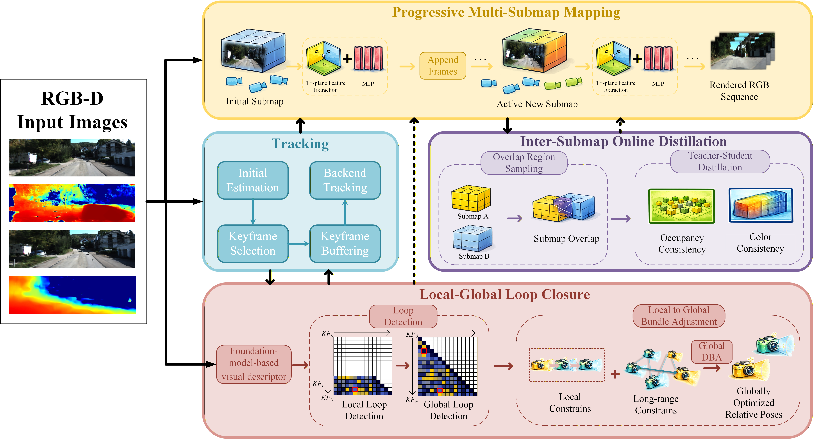

  <h1 align="center">MSN-SLAM: Multi-Submap Implicit Neural SLAM with Local-to-Global Loop Closure for Large-Scale Scene Reconstruction</h1>
  <h3 align="center"><a href="https://openaccess.thecvf.com/content/CVPR2024/papers/Deng_PLGSLAM_Progressive_Neural_Scene_Represenation_with_Local_to_Global_Bundle_CVPR_2024_paper.pdf">Paper</a> </h3>
  

  

## Abstract

Neural Radiance Fields (NeRF)-based SLAM has demonstrated impressive results in small-scale scene reconstruction, yet scaling these methods to extensive, complex environments remains challenging due to catastrophic forgetting and accumulated trajectory drift. This paper presents a robust, large-scale neural SLAM system featuring a multi-submap architecture and a dual-tier loop closure mechanism. Specifically, we propose a progressive mapping strategy that dynamically allocates neural submaps to maintain high-fidelity representations without memory explosion. For robust pose estimation, a optical flow-based tracking module is integrated to handle aggressive motions. To address global consistency, we introduce a local-to-global loop closure framework leveraging the foundation model for high-performance global descriptor extraction, significantly enhancing relocalization accuracy under varying viewpoints. Furthermore, an inter-submap online distillation algorithm is designed during back-end optimization to enforce geometric and appearance consistency across overlapping submap boundaries. To validate the system, we developed a customized handheld mechatronic platform and conducted extensive evaluations on both public benchmarks and our large-scale indoor-outdoor datasets. Experimental results, including direct deployment on an onboard computing unit, demonstrate that our approach outperforms state-of-the-art neural SLAM methods in reconstruction quality and localization robustness, providing a scalable solution for real-world robotic perception and digital twinning.

## Project Layout

## Prerequisites

## Run

## Contact

## Citing
